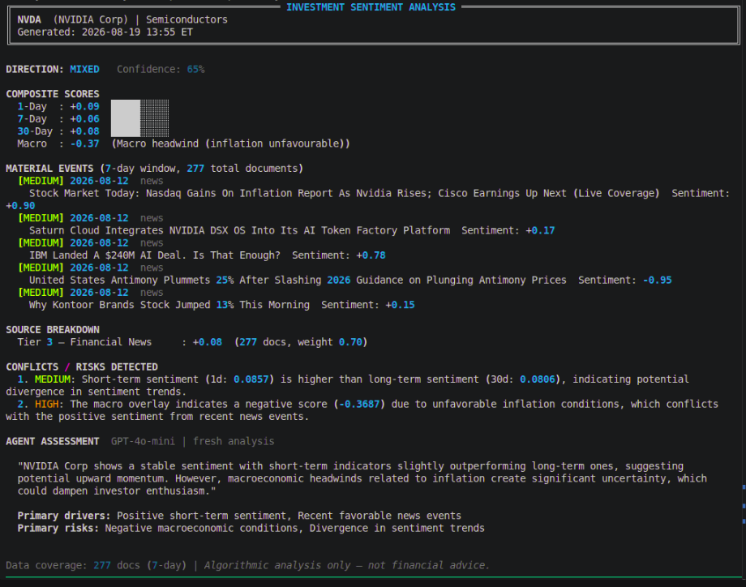
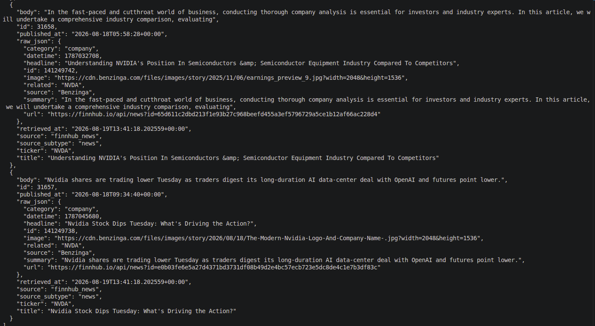
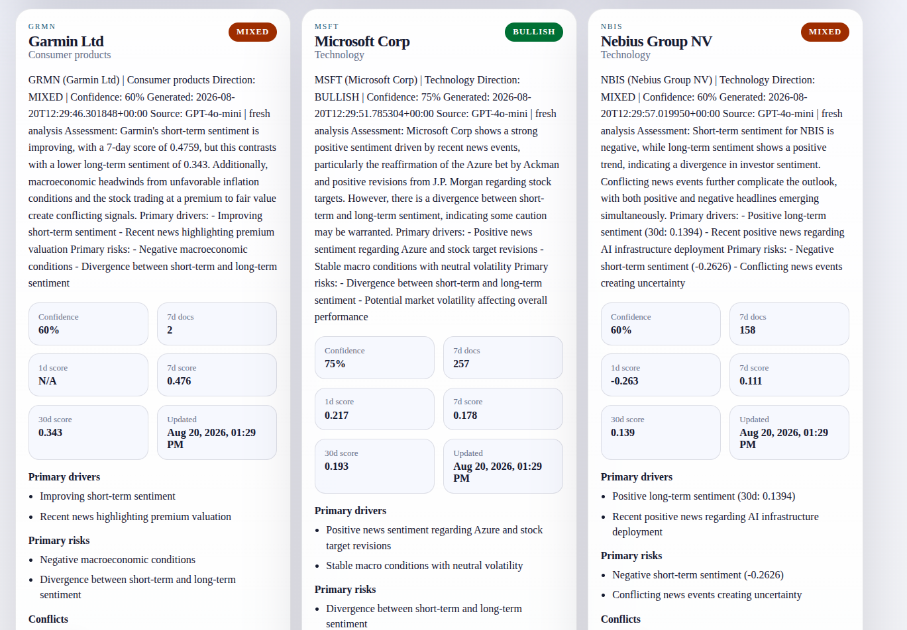

# Stock Sentiment

A tool for managing investment portfolios directly from your CLI. Run it directly, add it as a plugin to your favourite harnes or run it as a daily service.



Stock Sentiment turns a noisy stream of filings, transcripts, news, macro signals, and social chatter into a compact investment brief you can actually act on.

It is built for the exact moment when you want to answer questions like:

- What changed around this company in the last 24 hours?
- Is the signal broad-based or just one loud source?
- Are macro conditions reinforcing the story, or quietly fighting it?
- What are the main drivers, risks, and contradictions right now?

Instead of stopping at raw ingestion, the project stores the evidence, scores the documents, surfaces conflicts, and writes out a readable analysis bundle for each watched ticker.

## See it work

Inspect mode shows the raw evidence that entered the pipeline:



Analysis mode turns that evidence into a sentiment brief with drivers, risks, and conflict detection:


Feature rich UI view, allowing you to integrate that with your homelab for a daily visual rundown:  



## What this project includes

- A CLI for bootstrapping the database, managing a watchlist, running ingestion, inspecting stored documents, and generating analysis
- An ingestion layer for SEC filings, company IR feeds, Finnhub news and transcripts, Reddit, StockTwits, Federal Reserve content, and FRED macro data
- A processing pipeline for preprocessing, chunking, routing, deduplication, and FinBERT scoring
- A persistence layer backed by PostgreSQL/TimescaleDB
- An agent layer that synthesizes scored context through OpenAI or Anthropic
- A small FastAPI wrapper for remote analysis calls
- A static viewer that reads exported analysis bundles from disk
- Optional SMTP delivery for summary emails
- Systemd unit templates for long-running or scheduled Linux deployments

## Why it is useful

Most stock-data tools are either dashboards with shallow summaries or DIY data collectors that leave you with too much cleanup. Stock Sentiment sits between those extremes.

You get a local-first pipeline that can run in a homelab, on a VPS, or beside other internal tooling. The system keeps the raw artifacts, records the intermediate sentiment signals, and exports a final opinionated summary without hiding the evidence trail.

## Quick start

The fastest path is: create a virtualenv, set one LLM key, start the database, initialize the schema, add a ticker, and run one cycle.

### 1. Prerequisites

- Python 3.11+
- Docker with Compose support
- One LLM credential for the analysis step:
  - `OPENAI_API_KEY`, or
  - `ANTHROPIC_API_KEY`
- Optional API keys for richer ingestion: Finnhub, Reddit, FRED, FMP

### 2. Install dependencies

```bash
python3 -m venv .venv
source .venv/bin/activate
pip install -r requirements.txt
```

### 3. Create your environment file

```bash
cp .env.example .env
```

For a first run, fill in at least one LLM provider key in `.env`.

Recommended minimal setup:

```dotenv
LLM_PROVIDER=auto
OPENAI_API_KEY=
ANTHROPIC_API_KEY=
```

Leave `LLM_PROVIDER=auto` unless you want to force a specific backend. In `auto`, the app chooses the first configured provider in this order:

1. `OPENAI_API_KEY`
2. `ANTHROPIC_API_KEY`

### 4. Start TimescaleDB

```bash
docker compose up -d db
```

The included compose file now works without any pre-created external Docker network.

### 5. Initialize the database

```bash
python cli.py db-init
```

This does three things:

- runs Alembic migrations
- applies TimescaleDB setup objects
- seeds source-tier weights from `config/source_tiers.yaml`

### 6. Add a company to the watchlist

Using a ticker is the least ambiguous first run:

```bash
python cli.py add AAPL
```

### 7. Run one ingestion cycle

```bash
python cli.py run --once
```

### 8. Inspect what was stored

```bash
python cli.py inspect AAPL --limit 5 --text
```

### 9. Generate a fresh analysis

```bash
python cli.py analyze AAPL --fresh
```

The analysis bundle is written to `output/analysis/<ticker>/` by default.

## LLM providers

The synthesis stage supports two providers:

- OpenAI
- Anthropic

You can either let the app auto-select based on available keys, or force one with `LLM_PROVIDER`.

### OpenAI

Set:

```dotenv
LLM_PROVIDER=openai
OPENAI_API_KEY=...
```

### Anthropic

Set:

```dotenv
LLM_PROVIDER=anthropic
ANTHROPIC_API_KEY=...
```

Model defaults and escalation models are configurable in `.env.example`.

## Runtime modes

You can run the project in several ways depending on how “always-on” you want it to be.

### One-shot local run

Best for testing a new configuration.

```bash
python cli.py run --once
```

### Long-running daemon

Best for keeping ingestion workers alive continuously.

```bash
python cli.py run --interval daily
```

The scheduler supports values such as `15m`, `1h`, `daily`, `weekly`, and `2 weeks`.

### Systemd user service

User-service templates live in `ops/systemd/`.

```bash
mkdir -p ~/.config/systemd/user
cp ops/systemd/*.service ~/.config/systemd/user/
cp ops/systemd/*.timer ~/.config/systemd/user/
systemctl --user daemon-reload
```

Always-on mode:

```bash
systemctl --user enable --now stock-sentiment-daemon.service
```

Daily one-shot mode:

```bash
systemctl --user enable --now stock-sentiment-once.timer
```

If your checkout is not in `~/homelab/stock-sentiment-cli`, edit `WorkingDirectory` and `ExecStart` in the copied unit files before enabling them.

If you want services to keep running after logout:

```bash
sudo loginctl enable-linger "$USER"
```

After changing Python code or `.env`, restart the daemon:

```bash
systemctl --user restart stock-sentiment-daemon.service
```

## CLI reference

### `db-init`

Initializes the local database schema and seed data.

```bash
python cli.py db-init
```

### `add <company-or-ticker>`

Adds a company to the watchlist and queues a backfill task.

```bash
python cli.py add AAPL
python cli.py add "Apple"
```

### `remove <ticker>`

Removes a company from the watchlist.

```bash
python cli.py remove AAPL
```

### `list`

Lists watched companies and their backfill status.

```bash
python cli.py list
```

### `inspect <company>`

Reads stored source documents directly from the database.

```bash
python cli.py inspect AAPL --limit 5
python cli.py inspect AAPL --limit 5 --text
```

### `analyze <company>`

Runs the synthesis step and prints a formatted summary.

```bash
python cli.py analyze AAPL
python cli.py analyze AAPL --fresh
```

Use `--fresh` when you want to bypass the 6-hour analysis cache.

### `run`

Starts ingestion plus optional analysis.

```bash
python cli.py run --once
python cli.py run --interval 15m
python cli.py run --interval daily
python cli.py run --once --no-analysis
python cli.py run --once --email-to ops@example.com
python cli.py run --once --log-file ./stock-sentiment.log
```

## Optional services

### API

The API is a thin wrapper around the analysis path.

```bash
uvicorn api.app:app --reload
```

Endpoints:

- `POST /analyze`
- `GET /status/{ticker}`

Example request:

```bash
curl -X POST http://127.0.0.1:8000/analyze \
  -H 'content-type: application/json' \
  -d '{"company":"AAPL","force_refresh":true}'
```

### Viewer

The viewer serves exported analysis bundles from disk.

```bash
python viewer/app.py
```

Open `http://127.0.0.1:8000` in a browser.

Useful viewer environment overrides:

- `ANALYSIS_DIR` to point at a different export directory
- `VIEWER_PORT` to change the listen port

## Configuration guide

The environment file controls four categories of behavior.

### Core

- `DB_URL`, `DB_URL_SYNC` for PostgreSQL connections
- `ANALYSIS_OUTPUT_DIR` for exported summaries
- `FINBERT_DEVICE` with `auto`, `cpu`, or `cuda`
- `AGENT_CACHE_TTL` for analysis cache lifetime

### LLM synthesis

- `LLM_PROVIDER`
- `OPENAI_API_KEY`, `OPENAI_*`
- `ANTHROPIC_API_KEY`, `ANTHROPIC_*`

### Ingestion and enrichment

- `FINNHUB_KEY` for company resolution, news, and transcript support
- `REDDIT_CLIENT_ID`, `REDDIT_CLIENT_SECRET`, `REDDIT_USER_AGENT` for Reddit ingestion
- `FRED_API_KEY` and `MACRO_WEIGHT` for macro overlay behavior
- `FMP_API_KEY` as an optional transcript fallback

### Delivery

- `SMTP_HOST`, `SMTP_PORT`, `SMTP_USERNAME`, `SMTP_PASSWORD`, `SMTP_USE_TLS`, `SMTP_FROM`
- `EMAIL_TO` for default recipients
- `ANALYSIS_DIR`, `VIEWER_PORT` for the viewer

For the complete variable list, use `.env.example` as the contract.

## Project map

- `cli.py` — primary entry point
- `ingestion/` — all source adapters and scheduling logic
- `processing/` — preprocessing, chunking, model registry, and worker execution
- `deduplication/` — document deduplication helpers
- `aggregation/` — sentiment scoring and macro overlay logic
- `resolution/` — ticker and company resolution
- `agent/` — conflict detection, synthesis, and provider clients
- `db/` — models, async session setup, and Timescale helpers
- `output/` — formatted analysis exports
- `api/` — optional FastAPI surface
- `viewer/` — lightweight browser UI for exported summaries
- `ops/systemd/` — user-service templates for Linux
- `tests/` — unit coverage for core pipeline behavior
- `docs/` — architecture, deployment notes, and screenshots

## Documentation

- `docs/architecture.md` explains the moving parts and data flow
- `docs/deployment.md` covers local runs, systemd, API, viewer, and operating notes

## Development

Run the test suite with:

```bash
python -m pytest -q
```

If `pytest` is not installed in your environment yet, install dependencies first with `pip install -r requirements.txt`.

## Notes

- The pipeline only processes companies that are in the watchlist.
- If you omit external API keys, the system still starts, but ingestion coverage becomes narrower.
- FinBERT auto-detects whether the local Torch build can use CUDA. If not, it falls back to CPU.
- Source weights are seeded from `config/source_tiers.yaml` and can be tuned later.
- Sector-aware macro behavior is driven by `config/sector_macro_weights.yaml`.
